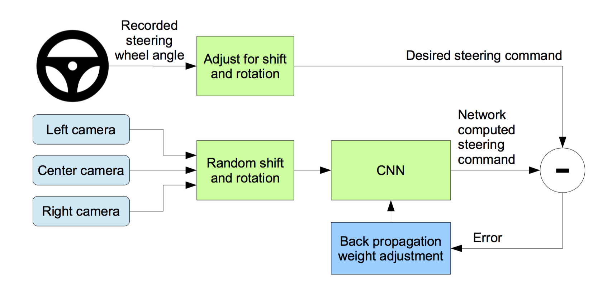
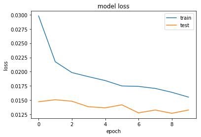

# **Behavioral Cloning** 

## Writeup Template

### You can use this file as a template for your writeup if you want to submit it as a markdown file, but feel free to use some other method and submit a pdf if you prefer.

---

**Behavioral Cloning Project**

The goals / steps of this project are the following:
* Use the simulator to collect data of good driving behavior
* Build, a convolution neural network in Keras that predicts steering angles from images
* Train and validate the model with a training and validation set
* Test that the model successfully drives around track one without leaving the road
* Summarize the results with a written report


[//]: # (Image References)

[image1]: ./report_data/finalAugumentedImage.png "Steering angle adjustement"
[image2]: ./report_data/beforeFlipping.png "Before Flipping"
[image3]: ./report_data/afterFlipping.png "After Flipping"
[image4]: ./report_data/beforeBrightness.png "Before Brightness Adjustement"
[image5]: ./report_data/afterBrightness.png "Before Brightness Adjustement"


## Rubric Points
### Here I will consider the [rubric points](https://review.udacity.com/#!/rubrics/432/view) individually and describe how I addressed each point in my implementation.  

---
### Files Submitted & Code Quality

#### 1. Submission includes all required files and can be used to run the simulator in autonomous mode

My project includes the following files:
* model.py containing the script to create and train the model
* drive.py for driving the car in autonomous mode
* model.h5 containing a trained convolution neural network 
* writeup_report.md or writeup_report.pdf summarizing the results


#### 2. Submission includes functional code
Using the Udacity provided simulator and my drive.py file, the car can be driven autonomously around the track by executing 
```sh
python drive.py model.h5
```

#### 3. Submission code is usable and readable

The model.py file contains the code for training and saving the convolution neural network. The file shows the pipeline I used for training and validating the model, and it contains comments to explain how the code works.

### Model Architecture and Training Strategy

#### 1. An appropriate model architecture has been employed

The model has been designed to take raw images of the test track after suitable preprocessing and generate a steering value corresponding to the amount of turn required to keep the test car on the track.

As the model presented in NVIDIA's paper [End to End Learning for Self-Driving Cars](https://arxiv.org/pdf/1604.07316v1.pdf) has proven to work on similar end-to-end learning problems, I decided to use the same for this project as well. 

Here is a visualization of the architecture
<figure>
 
 <figcaption>
 <p></p>
 </figcaption>
</figure>

After creating the model according to the architecture presented in the paper, some structural modifications were done in order to optimize it for the given problem statement.

My final model architecture is as shown below.


|Layer (type)        |Output Shape      |Params  |
|--------------------|------------------|-------:|
|Lambda              |(None, 66, 200, 3)|0       |
|Convolution2D       |(None, 31, 98, 16)|1216    |
|Convolution2D       |(None, 14, 47, 32)|12832   |
|Convolution2D       |(None, 6, 23, 64) |18496   |
|Convolution2D       |(None, 2, 11, 64) |36928   |
|Flatten             |(None, 1408)      |0       |
|Fully Connected     |(None, 100)       |140900  |
|Dropout             |(None, 100)       |0       |
|Fully Connected     |(None, 50)        |5050    |
|Dropout             |(None, 50)        |0       |
|Fully Connected     |(None, 10)        |510     |
|Fully Connected     |(None, 1)         |11      |


**Total Trainable params:** *215,943*
 

#### 2. Attempts to reduce overfitting in the model

The model contains dropout layers in order to reduce overfitting. It's trained and validated on different data sets to ensure that the model was not overfitting. The model was tested by running it through the simulator and ensuring that the vehicle could stay on the track.

#### 3. Model parameter tuning

The model used an adam optimizer, so the learning rate was not tuned manually.

#### 4. Appropriate training data

Training data was chosen to keep the vehicle driving on the road. I used a combination of center lane driving, recovering from the left and right sides of the road.

For details about how I created the training data, see the next section. 

### Model Architecture and Training Strategy

#### 1. Solution Design Approach

My first step was to use a convolution neural network model similar to the one presented in NVIDIA's paper [End to End Learning for Self-Driving Cars](https://arxiv.org/pdf/1604.07316v1.pdf). I thought this model might be appropriate because it has proven to work on similar end-to-end learning problems.

The paper concludes that with the proposed CNN architecture *We have empirically demonstrated that CNNs are able to learn the entire task of lane and road following without manual decomposition into road or lane marking detection, semantic abstraction, path planning, and control. A small amount of training data from less than a hundred hours of driving was sufficient to train the car to operate in diverse conditions, on highways, local and residential roads in sunny, cloudy, and rainy conditions. The CNN is able to learn meaningful road features from a very sparse training signal (steering alone).
The system learns for example to detect the outline of a road without the need of explicit labels during training.
More work is needed to improve the robustness of the network, to find methods to verify the robust- ness, and to improve visualization of the network-internal processing steps.*

Also, as mentioned in the **Section 6. titled *"Simulation"*** from the paper, *"Before road-testing a trained CNN, we first evaluate the networks performance in simulation. A simplified block diagram of the simulation system is shown in Figure 5.
The simulator takes pre-recorded videos from a forward-facing on-board camera on a human-driven data-collection vehicle and generates images that approximate what would appear if the CNN were, instead, steering the vehicle. These test videos are time-synchronized with recorded steering com- mands generated by the human driver."*

Here is the refered block diagram from the paper.
<figure>
 
 <figcaption>
 <p></p>
 </figcaption>
</figure>

As our process of data capturing, validation and test environment is also similar to what is proposed in the paper, I went ahead with a similar implementation but modified some layers and size of the network to suit our specific problem statement.

To combat overfitting, I modified the model to include dropouts between the fully connected layers.

The final step was to run the simulator to see how well the car was driving around track one. There were a few spots where the vehicle fell off the track. To improve the driving behavior in these cases, I employed data augumentation techniques as mentioned in the "Creation of the Training Set and Training Process" section.

At the end of the process, the vehicle is able to drive autonomously around the track without leaving the road.

#### 2. Creation of the Training Set & Training Process

Following steps were done to augment the data:

* Steering angle adjustment according to the chosen left/center/right camera: This step was done to train the nework on how to recover from sides of the road to the center. 

* Flipping images 180 degrees and reversing the steering angle: As the test track consists of more left turns than right, this step ensures we have a healthy combination of left and right turn images in our training data. 

* Changing the brightness of images: This is used to model shadows and varying brightness condistions on the test track.

Steering angel adjusted image
![alt text][image1]

Flipped image before and after.
![alt text][image2] ![alt text][image3]

Brightness adjusted image before and after.
![alt text][image4] ![alt text][image5]

I finally randomly shuffled the data set and put 20% of the data into a validation set. I used this training data for training the model. The validation set helped determine if the model was over or under fitting.

<figure>
 
 <figcaption>
 <p></p>
 </figcaption>
</figure>

As can be seen from th graph, the ideal number of epochs is around 6-8 as the validation loss more or less saturates by this time. I used an adam optimizer so that manually training the learning rate wasn't necessary.